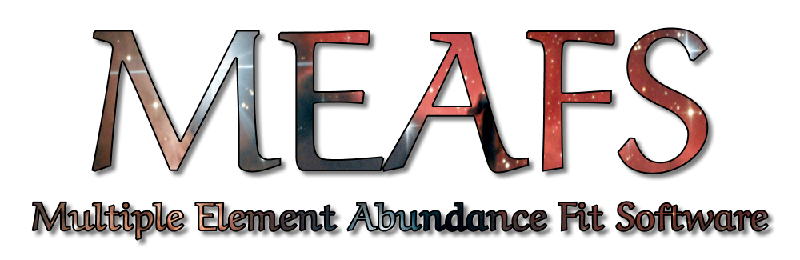
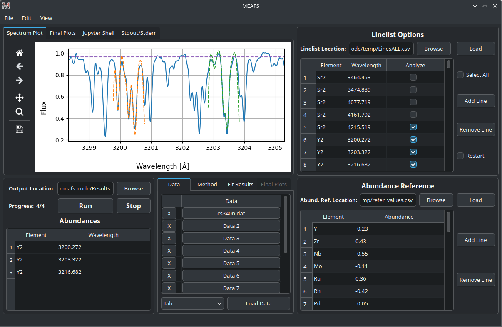

# Multiple Element Abundance Fit Software - MEAFS

[](https://meafs.readthedocs.io/)
[](https://pypi.org/project/meafs/)
[](https://github.com/MatheusJCastro/meafs)

*Written by: Matheus J. Castro*  
*Under MIT License*  

More information at: [https://meafs.readthedocs.io/](https://meafs.readthedocs.io/)

<hr/>
<hr/>

## Table of Contents

- [Multiple Element Abundance Fit Software - MEAFS](#multiple-element-abundance-fit-software---meafs)
  - [Table of Contents](#table-of-contents)
  - [Aims](#aims)
  - [Prerequisites](#prerequisites)
    - [Creating Anaconda Environment (recommended)](#creating-anaconda-environment-recommended)
    - [Step-by-Step for Windows (Python + GCC)](#step-by-step-for-windows-python--gcc)
      - [Python](#python)
      - [GCC](#gcc)
  - [Installation](#installation)
    - [Getting the pip version (recommended)](#getting-the-pip-version-recommended)
      - [Updates](#updates)
    - [Cloning from GitHub](#cloning-from-github)
  - [Post Installation](#post-installation)
    - [Adding the PATH (for non Anaconda installations)](#adding-the-path-for-non-anaconda-installations)
      - [Linux](#linux)
      - [Windows](#windows)
    - [Compilation](#compilation)
  - [Uninstall](#uninstall)
    - [Anaconda](#anaconda)
  - [Basic Usage](#basic-usage)
    - [With Installation](#with-installation)
    - [Without Installation](#without-installation)
    - [Flags and Arguments](#flags-and-arguments)
    - [Auto Save](#auto-save)

## Aims

The MEAFS is a fitting tool software for spectra abundance analysis. The aim is to provide a medium to high precision analysis for each individual absorption line in a given spectrum in a short time.
The software also fits the wavelength shift, continuum and convolution of the spectrum.



## Prerequisites

- Python3 and GCC needs to be previously installed in the system (step-by-step to install for Windows users [bellow](<#step-by-step-for-windows-python--gcc>));

- A software for creating a synthetic spectrum also needs to be previously installed. This version of MEAFS is compatible with the following softwares:
    - Turbospectrum2019: [https://github.com/bertrandplez/Turbospectrum2019](https://github.com/bertrandplez/Turbospectrum2019)

- Optionally: to execute the *unify_plots.py*, a LaTeX installation must be present on the system.

- Optionally: [Anaconda](<#creating-anaconda-environment-recommended>).

### Creating Anaconda Environment (recommended)
- First, download anaconda [here](https://www.anaconda.com/products/individual#download-section) and execute the script.

    - For Linux users, if needed, export anaconda to your path by adding the line `export PATH="/home/USERNAME/anaconda3/bin:$PATH"` (changing the `USERNAME` to your user) to the `~/.bashrc` file. Close and open a new terminal to update the path.

    - If desirable, disable auto activation of anaconda with `conda config --set auto_activate_base false`.

- Create MEAFS environment with `conda create python -n meafs`;

- Then, to activate the environment, type `conda activate meafs`;

### Step-by-Step for Windows (Python + GCC)

If you are running Windows **without** Anaconda, you need to install Python and GCC, if you did not already have them. Otherwise, you can skip this.  
If you are using Windows **with** Anaconda, only GCC is required.

Obs: this step-by-step guide was made using a fresh new install of Windows 10.

#### Python

Go to [Python Windows Releases](https://www.python.org/downloads/windows/) and download a stable release by clicking on it and downloading the *Windows installer (64-bit) Recommended*. After downloading, execute the files and follow the installation process.

- Add the Python folder to the path.
    - Open the menu and search for *path*, click *Edit the system environment variables*, at the bottom right click *Environment Variables...*, in the tab *System variables* (attention: not the *User variables for Username*), look for the variable *Path* and click *Edit*. Add two new lines:
        - `C:\Users\USERNAME\AppData\Local\Programs\Python\Python311`
        - `C:\Users\USERNAME\AppData\Local\Programs\Python\Python311\Scripts`
        - Change `USERNAME` with your username and `Python311` to the actual version that you installed.
- Go to the python folder (ex: `C:\Users\USERNAME\AppData\Local\Programs\Python\Python311`) and create a copy of the `python.exe` file in the same location with the name `python3.11.exe`

#### GCC

Download the *x64* version of [Winlibs](https://winlibs.com).
    
- Choose the x64 MCF **with** all the libraries;
- After downloading, decompress the file and move the `mingw64` folder to `C:\Program Files\`;
- Now add the folder `bin` of the `mingw64` folder to the path:
  - Use the sames steps as before but now add the line: `C:\Program Files\mingw64\bin`.

## Installation

There are many options to run MEAFS. We strongly recommend the use of Anaconda environment, but it is not mandatory.  
You can install it with pip or run directly the source code from the repository.  

All the methods listed below work in Linux, Windows or MacOS **if you have python and gcc installed** (step-by-step to install for Windows users [bellow](<#step-by-step-for-windows-python--gcc>)).

### Getting the pip version (recommended)

The pip version can easily be acquired by typing in the terminal:

```bash
pip install meafs
```

#### Updates

Updates when using the pip version are handle by pip itself. To force an update, type in the terminal:

```bash
pip install meafs --upgrade
```

### Cloning from GitHub

Or you can directly clone from the GitHub page with:

```bash
git clone https://github.com/MatheusJCastro/meafs.git
```

After cloning, you can install it with pip or run without any installation at all (see the [Basic Usage - Without Installation](<#without-installation>) section).  

To build the package and install it with pip from the source, first install the `build` package:  

```bash
pip install build
```

Then go to the MEAFS source code directory and type:

```bash
python3 -m build
pip install .
```

Updates need to be handle by the user by cloning new versions and building it again.

## Post Installation

### Adding the PATH (for non Anaconda installations)
If you do not use Anaconda, you need to add the path of the pip scripts into the system path variable if you have not already done so.  
**This step is not necessary if you are running without installation.**

#### Linux
For Linux users, you can add the following line in the end of the file `~/.bashrc`, changing `USER` to your own user.

```bash
export PATH="${PATH}:/home/USER/.local/bin/"
```

For some Linux distributions and Python installations, the location of the executables can slightly change. If this does not work out, you can try different paths such as `/usr/local/bin` and others.

#### Windows

For Windows users, use the sames steps as in [Step-by-Step for Windows](<#step-by-step-for-windows-python--gcc>) for the path only, but now check if those lines are already there, if not, add them:

```bat
C:\Users\Windows\AppData\Local\Packages\PythonSoftwareFoundation.Python.3.11_qbz5n2kfra8p0\LocalCache\local-packages\Python311\Scripts
```

Or:

```bat
C:\Users\USERNAME\AppData\Local\Programs\Python\Python311\Scripts
```

**Be aware of different Python versions, the path will change also. Always verify if the current path exists.**

### Compilation

There is one file written in C Language (`meafs/meafs_code/scripts/bisec_interpol.c`), **in the first run, MEAFS will compile the C library using GCC**. Otherwise, the compilation directives can be found in `meafs/meafs_code/scripts/comp.sh`. The C file needs to be compiled as a shared library, when using *GCC Compiler*, this can be achieved by adding the `-shared` flag.

If the auto compilation fails, for Linux users, just add execution privileges at the `comp.sh` file and execute it in a terminal to create the binary. For that, open a terminal in the `meafs/meafs_code/scripts/` folder and type:

```bash
chmod +x comp.sh
./comp.sh
```

If you are on Windows, check this `comp.sh` file for the full `gcc` command.

## Uninstall

If you did not install with pip (both directly or by cloning), you can just erase the *meafs* folder.  

Otherwise, first remove the menu entries (if you have added it, see [Basic Usage - With Installation](<#with-installation>)) and then uninstall:

```bash
meafs-desktop-remove
pip uninstall meafs
```

### Anaconda

If you have created an Anaconda environment, you can delete it with:

```bash
conda env remove --name meafs
```

## Basic Usage

### With Installation
You can create menu entries for MEAFS by typing in the terminal or cmd:  

```bash
meafs-desktop-create
```

Then, search in the menu for *MEAFS*, and in Windows, a Desktop link will also be created.  
Or, you can just type in the terminal or cmd: 

```bash
meafs
```

Or:

```bash
python -m meafs_code
```

For the command line option, do not forget to activate the Anaconda environment if you are using it. For the menu entry, this is done automatically if necessary.

Since MEAFS is a Python library, you can always import it in your own program and run specific functions (see [Package Overview](https://meafs.readthedocs.io/en/latest/modules.html)):

```python
import meafs_code as meafs
```

### Without Installation
Simply execute the file `meafs_code/gui.py` and it will power the GUI.

### Flags and Arguments

There are some flags that can be passed with the command-line.

- `-h`, `--help`: Show the help section;
- `-v`, `--version`: Show version number;
- `-l`, `--last`: Load the last closed session. Default location is `meafs_code/auto_save_last.pkl`;
- `-s`, `--load-auto-save`: Load the auto saved session. Default location is: `meafs_code/auto_save.pkl`.

Also, any saved section can be passed as an argument and MEAFS will power the GUI with it:

```bash
meafs path/to/session.pkl
```

If no argument is given, the GUI will power with a new empty session.

### Auto Save
In the *File* menu there is an *Auto Save* option. When checked, MEAFS will save the session every 5 seconds in a file named `auto_save.pkl`.  
Also, if auto save is enabled, when MEAFS is closed, it will save the session in the `auto_save_last.pkl` file.  
These files are located under the MEAFS directory and the `-h` [flag](<#flags-and-arguments>) will show their location.  
To load any of these files, simply use the [flags](<#flags-and-arguments>) or load them in the *File* > *Open...* menu.

<hr/>
