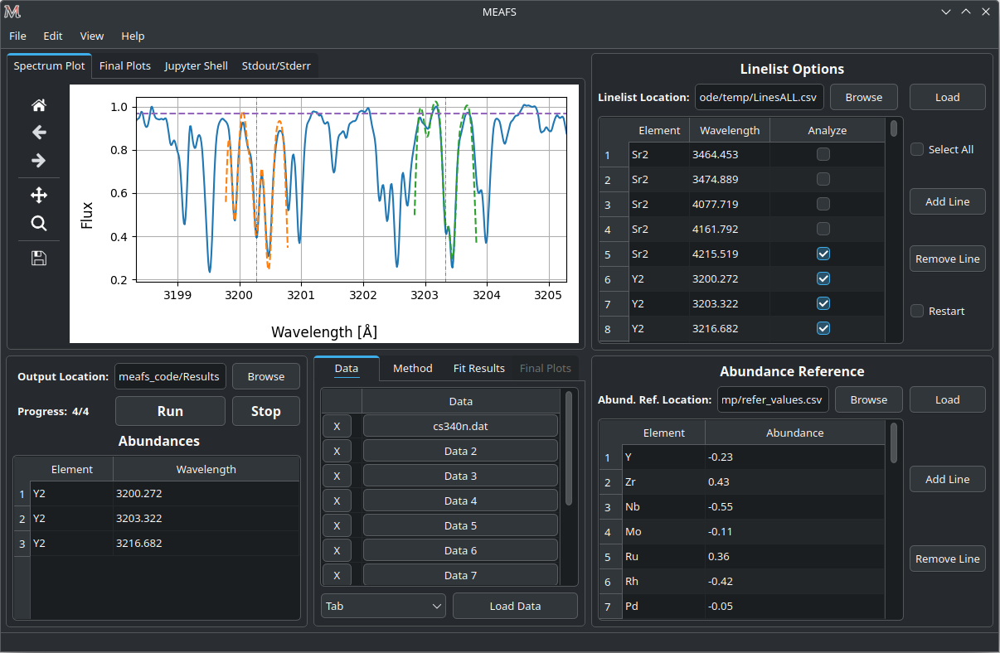

.. MEAFS documentation master file, created by
   sphinx-quickstart on Tue May 28 11:37:22 2024.
   You can adapt this file completely to your liking, but it should at least
   contain the root `toctree` directive.

Multiple Element Abundance Fitting Software - MEAFS
=================================================================================

.. image:: https://img.shields.io/readthedocs/meafs?logo=readthedocs
   :alt: Read the Docs
   :target: https://meafs.readthedocs.io/
.. image:: https://img.shields.io/pypi/v/meafs?logo=pypi
   :alt: PyPI - Version
   :target: https://pypi.org/project/meafs/
.. image:: https://img.shields.io/github/v/tag/MatheusJCastro/meafs?logo=github
   :alt: GitHub Tag
   :target: https://github.com/MatheusJCastro/meafs

| Here you can find how to install, run and read the results from MEAFS v\ |release|.

| *Written by: Matheus J. Castro*  
| *Under MIT License*  

Aims
----

The MEAFS is a fitting tool software for spectra abundance analysis. The aims is to provide a medium to high analysis for each individual absorption line in a given spectrum.  
The software also fits the wavelength shift, continuum and convolution of the spectrum.

| 

.. toctree::
   :maxdepth: 1
   :caption: Contents:
   
   installation
   usage
   manual
   modules

Indices and tables
==================

* :ref:`genindex`
* :ref:`modindex`
* :ref:`search`
