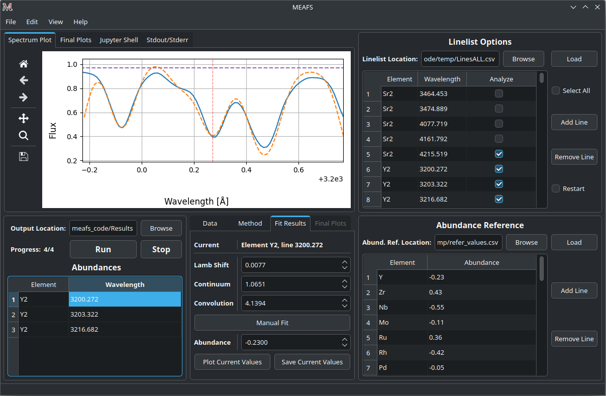
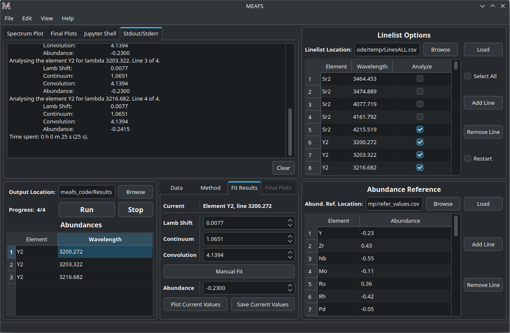

User Manual
===========

View mode
---------

MEAFS can adapt to the system settings and can be used in the Light or Dark mode, 
as bellow.

.. image:: _static/meafs_gui_01.png
   :width: 49%
   :alt: GUI White

.. image:: _static/meafs_gui_02.png
   :width: 49%
   :alt: GUI White

Loading a line-list
-------------------

.. image:: _static/meafs_gui_02.1.png
   :width: 80%
   :align: center
   :alt: GUI linelist load

| 

MEAFS operates in a line-list based workflow. Every single measurement, needs
to be listed in the line-list. 

There are three columns in the line-list field:

========== =====================================================
Element    The element and order of the corresponded wavelength.
Wavelength The wavelength intended to be analyzed.
Analyze    A checkbox if this wavelength should or should not 
           be analyzed.
========== =====================================================

| The table can be manually filled or a *CSV* file with two columns can be imported.
| For the first one, you can simply write in the table values, and click 
  *Add Line* or *Remove Line* buttons to match the number of rows desired.
| For the Second one, click *Browse* and select the line-list file, then 
  click *Load* to load the data in the table.

Obs: rows beginning with ``#`` in the *CSV* file are ignored.

The checkbox *Select All* can check or uncheck all the *Analyze* column 
checkboxes.

The *Restart* checkbox change the behavior of MEAFS in how it will read the 
line-list. If it is **unchecked**, MEAFS will ignore lines that are already
in the *found_values.csv* file (see :ref:`analyzing_results`). Otherwise, if it is 
**checked**, MEAFS will fit all selected lines and overwrite the **entire** results 
file.

Loading abundance references
----------------------------

.. image:: _static/meafs_gui_02.2.png
   :width: 80%
   :align: center
   :alt: GUI abundref load

| 

The *Abundance Reference* table works in the same way as the *Linelist* table.
Except for that there are only two columns:

========= =========================================
Element   The element that the abundance refers to.
Abundance The reference abundance for this element.
========= =========================================

The reference abundance will be used as the first guess for the 
optimization method (:ref:`eq_width` excluded).

Loading spectra data
--------------------

.. image:: _static/meafs_gui_02.3.png
   :width: 80%
   :align: center
   :alt: GUI dataload

| 

| Up to 10 spectra can be loaded in MEAFS. For this, go to the *Data* tab and 
  click one of the fields numbered from *Data 1* to *Data 10* and select the 
  file.
| Only the name of the file will be showed. But, the full path of the file can 
  always be checked by holding the mouse on top of the button, like the
  image bellow.

.. image:: _static/meafs_gui_04.1.png
   :width: 80%
   :align: center
   :alt: GUI data tooltip

| 

| Each spectrum should be a simple *ASCII* file (*.txt*, *.csv*, *.dat*) 
  with two columns: Wavelength and Flux.
| Currently, these types of separators are supported: 

   - Tab/Multiple spaces
   - Comma

Obs: rows beginning with ``#`` in the *CSV* file are ignored.

Selecting the method
--------------------

.. image:: _static/meafs_gui_05.1.png
   :width: 80%
   :align: center
   :alt: GUI method select

| 

Currently, in the *Methods* tab, these methods to generate a synthetic spectrum 
can be selected:

============= =============================================================
Method        Description
============= =============================================================
Eq. Width     Uses a Gaussian, Lorentzian or Voigt profile to create the 
              spectrum.
TurboSpectrum Uses the TurboSpectrum (Plez B, 2012) to create the spectrum. 
============= =============================================================

.. _eq_width:

Equivalent Width
^^^^^^^^^^^^^^^^

For this method, it can be used three different functions:

- Gaussian:
  
  .. math:: f(x) = a \cdot \exp\left[\frac{-(x - b)^2}{c \cdot \sqrt{2 \cdot \pi}}\right] + d
     :label: gaussdocs

- Lorentzian:

  .. math:: g(x) = a \cdot \exp\left[\frac{c}{\pi \cdot ((x - b)^2 + c^2)}\right] + d
     :label: lorendocs

- Voigt:

  .. math:: h(x) = a \cdot f(x) \cdot g(x) + d
     :label: voigtdocs

  With :math:`f(x)` being the :eq:`gaussdocs` and :math:`g(x)` 
  being the :eq:`lorendocs`.

  In this case, the values of :math:`a` and :math:`d` for both :math:`f(x)` 
  and :math:`g(x)` are :math:`=0`.

The first guess for the method fit can also be defined:

=========== ===================
Convolution Parameter :math:`c`
Deepth      Parameter :math:`a`
=========== ===================

TurboSpectrum
^^^^^^^^^^^^^

.. image:: _static/meafs_gui_06.1.png
   :width: 80%
   :align: center
   :alt: GUI method select

| 

| To run TurboSpectrum, first download it and create all the 
  necessary models. Also, it is needed to set the TurboSpectrum 
  configuration file to the specific needs of the user.
| It is also important to add all the elements in this configuration file,
  as MEAFS will not add then, but just look for it and change the value.

- TurboSpectrum2019 can be found here: 
  `<https://github.com/bertrandplez/Turbospectrum2019>`_
- TurboSpectrum_NLTE (not tested) can be found here: 
  `<https://github.com/bertrandplez/Turbospectrum_NLTE>`_

In the first run of MEAFS, it will be created a folder called *modules* at 
the root directory of MEAFS (this directory can be found by typing in a
terminal ``meafs -h``). It is advised (but not mandatory) to add the 
TurboSpectrum module in this folder.

Full run
--------

.. image:: _static/meafs_gui_02.4.png
   :width: 80%
   :align: center
   :alt: GUI run

| 

After filling all the other tables and selecting the desired synthetic 
spectrum method, the results folder location needs to be defined. click
*Browse* and select the folder.

Obs: If the folder name is not "Results", MEAFS will create another folder 
inside the select one with this name.

To run, just click *Run* to start the fit of all selected lines and *Stop* 
to end the run in the middle.

Obs: the *Stop* button will finish the current line before it takes effect.

While running, the GUI will be frozen, being actualized only few times 
after each line. At each actualization, the plot area and the tab *Fit 
Parameters* will show the last successful fit.

At the end of each line, MEAFS save the results. In case of an unwanted 
interruption, open MEAFS again and use the menu option *File* > *Open 
Abundances...* and it will populate the plot and the results table.

Fit parameters
^^^^^^^^^^^^^^

.. image:: _static/meafs_gui_11.png
   :width: 80%
   :align: center
   :alt: GUI run

| 

Continuum check
+++++++++++++++

.. image:: _static/meafs_gui_14.png
   :width: 80%
   :align: center
   :alt: GUI run
   
| 

.. _analyzing_results:

Analyzing the results
^^^^^^^^^^^^^^^^^^^^^

   
| 

Fit only abundance run
----------------------

No fit run
----------

Jupyter Shell
-------------

.. image:: _static/meafs_gui_09.png
   :width: 80%
   :align: center
   :alt: GUI run

| 

The Jupyter Shell provides access to the MEAFS session with all the 
variables and functions available. It can be useful for more advanced
user or for debug. See :ref:`pack_overview` for the list of variables and functions.

Stdout and Stderr
-----------------

| 

All print functions and errors of the code are redirected to the 
Stdout/Stderr tab. Use it for debug and/or follow up the fit process.

Save and open sessions
----------------------

.. image:: _static/meafs_gui_12.png
   :width: 80%
   :align: center
   :alt: GUI run

| 

MEAFS uses the *dill* library to create sessions of the current loaded
values. Sessions can be saved and opened, or a new empty one can be created. 
Note that creating a new session will erase all the values, 
save the current one before doing this.

Auto Save
^^^^^^^^^

There is an *Auto Save* function that will save a session every 5 seconds. 
Not only that, every time the MEAFS is closed, it will trigger to save the
session if the auto save is on.

To enable or disable this function, go to *File* > *Auto Save*.

The files are created at the root MEAFS directory (this directory can be 
found by typing in a terminal ``meafs -h``). The two types of auto save
are saved under these names:

==================== ===================================
File Name            Description
==================== ===================================
*auto_save.pkl*      Session saved every 5 seconds.
*auto_save_last.pkl* Session saved when MEAFS is closed.
==================== ===================================

To open the last *5 seconds auto save* file, go to a terminal and type:

.. code-block:: bash

   meafs -s

And to open the last closed session, type:

.. code-block:: bash

   meafs -l

Open old results
^^^^^^^^^^^^^^^^

| If you have results from a previous run (*.csv* file) and the folder 
  *On_time_plots*, you can go to the menu option *File* > *Open 
  Abundances...* and select the *CSV* file.
| MEAFS will read the file and populate te results tab with the 
  information there. Also, it will look for a folder called *On_time_plots*
  in the same directory of the file to plot all lines that it finds 
  inside of it.
| Note that the *CSV* file is mandatory, while the folder containing the
  old plots, is not