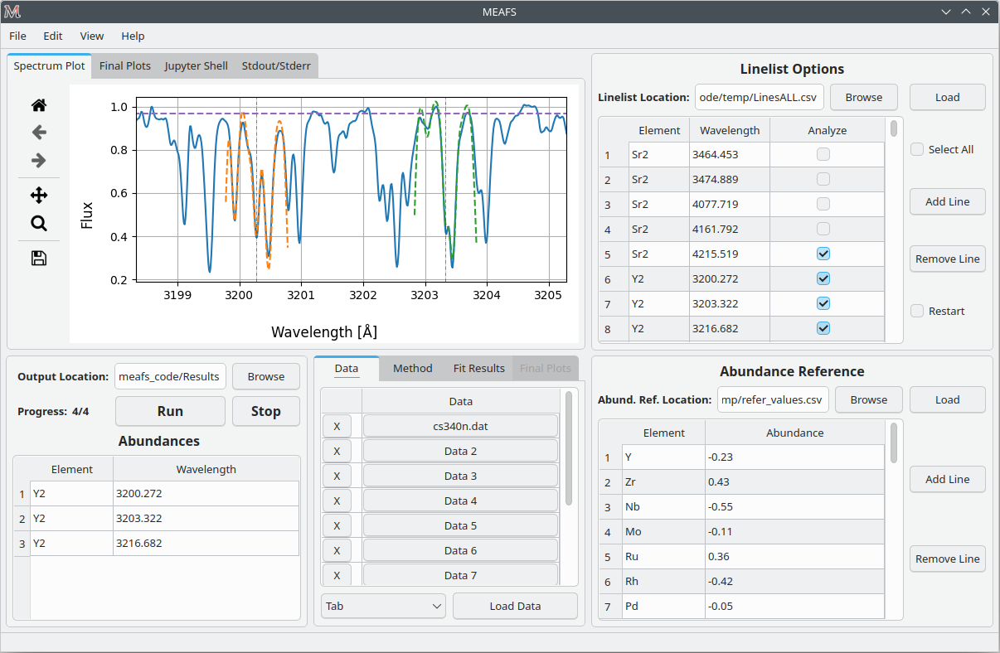
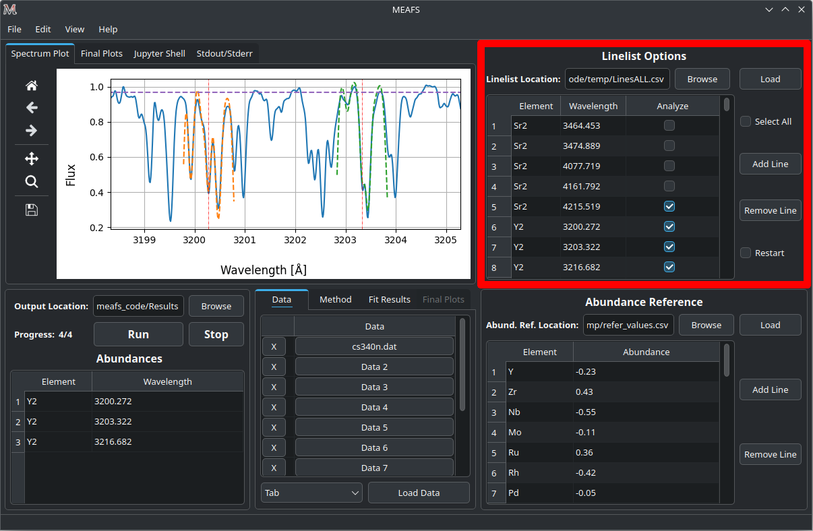
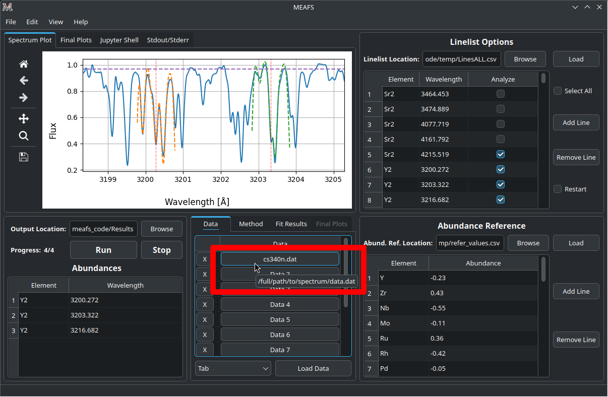
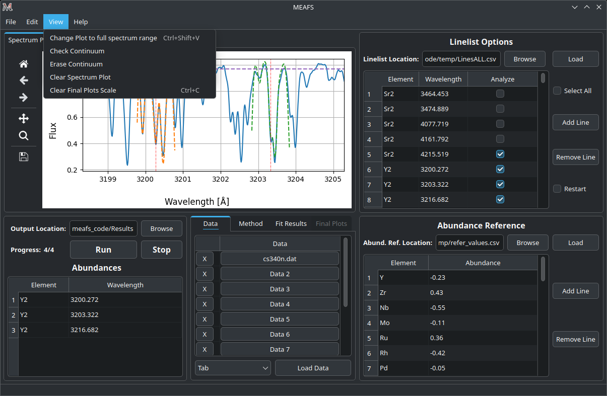
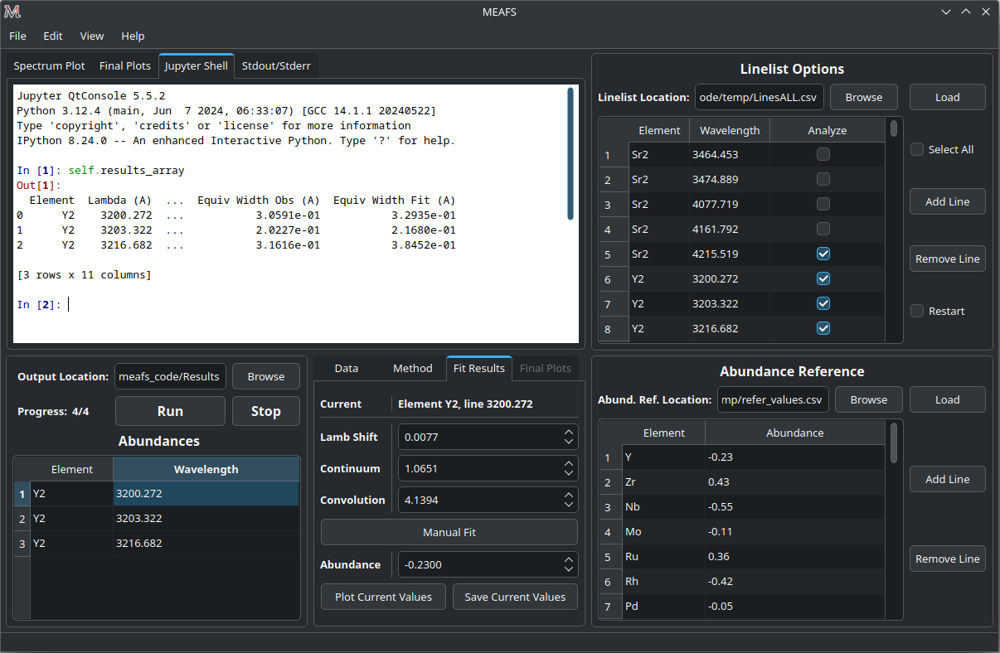
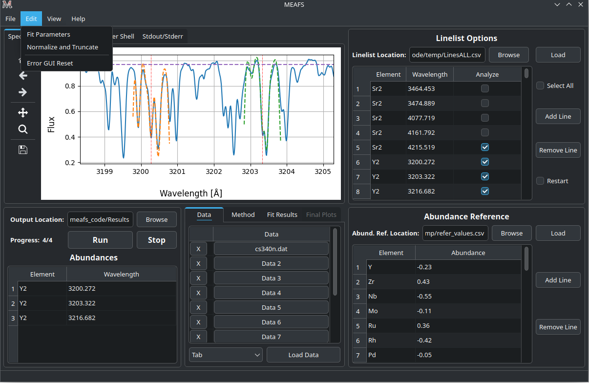
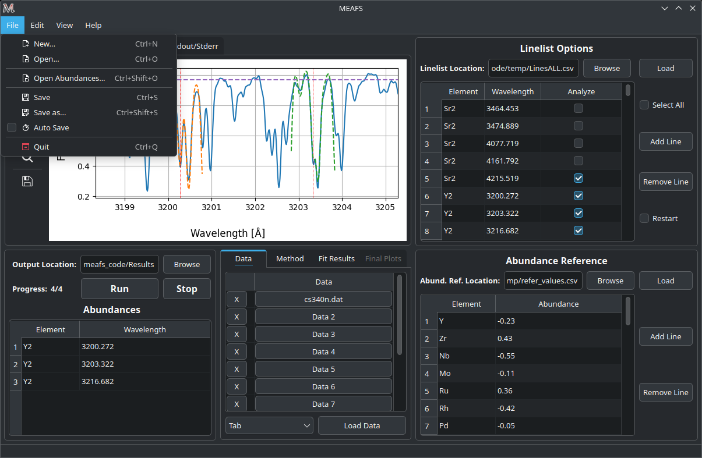

.. |ang| unicode:: U+212B
   :trim:

User Manual
===========

Starting MEAFS
--------------

View mode
---------

MEAFS can adapt to the system settings and can be used in the Light or Dark mode, 
as bellow.

.. image:: _static/meafs_gui_02.png
   :width: 49%
   :alt: GUI White

Loading a line-list
-------------------

| 

MEAFS operates in a line-list based workflow. Every single measurement, needs
to be listed in the line-list. 

There are three columns in the line-list field:

========== =====================================================
Element    The element and order of the corresponded wavelength.
Wavelength The wavelength intended to be analyzed.
Analyze    A checkbox if this wavelength should or should not 
           be analyzed.
========== =====================================================

| The table can be manually filled or a *CSV* file with two columns can be imported.
| For the first one, simply write it in the table values, and click 
  *Add Line* or *Remove Line* buttons to match the number of rows desired.
| For the second one, click *Browse* and select the line-list file, then 
  click *Load* to load the data in the table.

Obs: rows beginning with ``#`` in the *CSV* file are ignored.

The checkbox *Select All* can check or uncheck all the *Analyze* column 
checkboxes.

The *Restart* checkbox change the behavior of MEAFS in how it will read the 
line-list. If it is **unchecked**, MEAFS will ignore lines that are already
in the *found_values.csv* file (see :ref:`analyzing_results_full`). Otherwise, if it is 
**checked**, MEAFS will fit all selected lines and **overwrite** them in the results 
file.

If a line that is selected is out of the range of any spectrum data, this line will be 
skipped.

Loading abundance references
----------------------------

.. image:: _static/meafs_gui_02.2.png
   :width: 80%
   :align: center
   :alt: GUI abundref load

| 

The *Abundance Reference* table works in the same way as the *Linelist* table.
Except for that there are only two columns:

========= =========================================
Element   The element that the abundance refers to.
Abundance The reference abundance for this element.
========= =========================================

The reference abundance will be used as the first guess for the 
optimization method (:ref:`eq_width` excluded).

Loading spectra data
--------------------

| 

| Up to 10 spectra can be loaded in MEAFS. For this, go to the *Data* tab and 
  click one of the fields numbered from *Data 1* to *Data 10* and select the 
  file.
| Only the name of the file will be showed. But, the full path of the file can 
  always be checked by holding the mouse on top of the button, like the
  image below.

| 

| Each spectrum should be a simple *ASCII* file (*.txt*, *.csv*, *.dat*) 
  with two columns: Wavelength and Flux.
| Currently, these types of separators are supported: 

   - Tab/Multiple spaces
   - Comma

Obs: rows beginning with ``#`` in the *CSV* file are ignored.

**Attention:** For overlapping spectra, the fit will be processed only for the first spectrum in the *Data* table order. Moreover, it is advised not to upload spectra with edge effects (e.g., zero flux; see image below). Otherwise, if allocated first in the *Data* table, MEAFS will attempt to fit the non-existing data in the first spectrum instead of the one with real data.

| 

Selecting the method
--------------------

.. image:: _static/meafs_gui_05.1.png
   :width: 80%
   :align: center
   :alt: GUI method select

| 

Currently, in the *Methods* tab, these methods to generate a synthetic spectrum 
can be selected:

============= =============================================================
Method        Description
============= =============================================================
Eq. Width     Uses a Gaussian, Lorentzian or Voigt profile to create the 
              spectrum.
TurboSpectrum Uses the TurboSpectrum (Plez B, 2012) to create the spectrum. 
============= =============================================================

.. _eq_width:

Equivalent Width
^^^^^^^^^^^^^^^^

For this method, it can be used three different functions:

- Gaussian:
  
  .. math:: f(x) = a \cdot \exp\left[\frac{-(x - b)^2}{c \cdot \sqrt{2 \cdot \pi}}\right] + d
     :label: gaussdocs

- Lorentzian:

  .. math:: g(x) = a \cdot \exp\left[\frac{c}{\pi \cdot ((x - b)^2 + c^2)}\right] + d
     :label: lorendocs

- Voigt:

  .. math:: h(x) = a \cdot f(x) \cdot g(x) + d
     :label: voigtdocs

  With :math:`f(x)` being the :eq:`gaussdocs` and :math:`g(x)` 
  being the :eq:`lorendocs`.

  In this case, the values of :math:`a` and :math:`d` for both :math:`f(x)` 
  and :math:`g(x)` are :math:`=0`.

The first guess for the method fit can also be defined:

=========== ===================
Convolution Parameter :math:`c`
Depth       Parameter :math:`a`
=========== ===================

TurboSpectrum
^^^^^^^^^^^^^

| 

| To run TurboSpectrum, first download it and create all the 
  necessary models. Also, it is needed to set the TurboSpectrum 
  configuration file to the specific needs of the user.
| It is also important to add all the elements in this configuration file,
  as MEAFS will not add then, but just look for it and change the value.

- TurboSpectrum2019 can be found here: 
  `<https://github.com/bertrandplez/Turbospectrum2019>`_
- TurboSpectrum_NLTE (not tested) can be found here: 
  `<https://github.com/bertrandplez/Turbospectrum_NLTE>`_

In the first run of MEAFS, it will be created a folder called *modules* in 
the root directory of MEAFS (this directory can be found by typing in a
terminal ``meafs -h``). It is advised (but not mandatory) to add the 
TurboSpectrum module in this folder.

Full run
--------

| 

After filling all the other tables and selecting the desired synthetic 
spectrum method, the results folder location needs to be defined. click
*Browse* and select the folder.

Obs: If the folder name is not "Results", MEAFS will create another folder 
inside the select one with this name.

To run, just click *Run* to start the fit of all selected lines and *Stop* 
to end the run in the middle.

Obs: the *Stop* button will finish the current line before it takes effect.

While running, the GUI will be frozen, being actualized only few times 
after each line. At each actualization, the plot area and the tab *Fit 
Results* will show the last successful fit.

At the end of each line, MEAFS save the results. In case of an unwanted 
interruption, open MEAFS again and use the menu option *File* > *Open 
Abundances...* and it will populate the plot and the results table (see 
:ref:`open_old_results`).

Fit parameters
^^^^^^^^^^^^^^

.. image:: _static/meafs_gui_11.png
   :width: 80%
   :align: center
   :alt: GUI run

| 

There are several options to change how the fit is done. This menu is 
located in *Edit* > *Fit Parameters*. 

Change it with caution, since this can drastically modify the results. 

Forced Loop Iterations
++++++++++++++++++++++

There is one parameter that determines how many iterations the main fit 
routine will run. 

The main goal here is to have the first fit with no guesses and a second 
one using the results of the previous one as a start point. That is why 
the default value is 2.

Interaction range (\ |ang|\ ) for each fit
++++++++++++++++++++++++++++++++++++++++++

For each fit, the spectrum will be restrained to a certain range. The 
parameters here determine this range. 

For example, the plot range, by default, plots a range of :math:`1 Å` 
(centered in the wavelength of the line and :math:`0.5 Å` for each side). 
But let's suppose that it is needed to see a line in the same plot that 
is :math:`1.2 Å` apart from the line that has been fitted. Then, the 
range for the plot can be set for :math:`3 Å`.

For the abundance, if a wide range is used, the :math:`\chi^2` may not
be fully minimized, since the abundance in the synthetic spectrum only 
changes the lines of that specific element. Therefore, a smaller range 
may benefit the minimization. The resolution of the spectrum can have a 
huge impact on this. 

Fit Maximum Iterations
++++++++++++++++++++++

This sets a limit to the maximum number of iterations that each method 
can use. This can have an impact in how long does it take to fit a line 
and if it will actually be fitted or the method will be ended before it 
achieves a satisfactory result.

Wave. Shift (\ |ang|\ ) Boundaries
++++++++++++++++++++++++++++++++++

The wavelength shift fit sometimes can try to fit a line that is next to 
the desired one, especially for crowded regions. To prevent this of 
happening, the boundaries of the fit can be defined. 

Convolution Boundaries
++++++++++++++++++++++

The convolution parameters are very specific for each spectrum and, if 
the user already have a guess of what it is, the constrains can be 
fixed.

.. _continuum_fit_param:

Continuum Fit Parameters
++++++++++++++++++++++++

There are 3 different methods to fit the continuum:

- Chebyshev
- Sigma-clipping
- Simple Average

And also an option to disable the fit at all and use a fixed value for the 
continuum. The default behavior is to use the Chebyshev method.

See :ref:`check_cont` for a way to verify if the chosen method and its 
parameters are satisfactory or not.

Chebyshev
#########

The Chebyshev method is as described in `Astropy Chebyshev1D <https://docs
.astropy.org/en/stable/api/astropy.modeling.polynomial.Chebyshev1D.html>`_.
It is an univariate Chebyshev series defined as:

.. math::
   P(x) = \sum^{i=n}_{i=0} C_i \times T_i (x)

With :math:`T_i (x)` being the corresponding Chebyshev polynomial of the 1st 
kind.

The input parameter is the *Median Window*, which is defined `here <https://
docs.astropy.org/en/stable/modeling/polynomial_models.html#domain-window-note>`_.

Sigma-clipping
##############

The *Sigma-clipping continuum level* method described in Sánchez-Monge, 
2018: *STATCONT: A statistical continuum level determination method for 
line-rich sources*.

To summarize it, it is a iteration method that exclude outliers to find 
the median and the standard deviation of the flux axis and uses these 
values for the continuum and its errors, respectively.

The process involves two parameters that determine how the method will 
be handled:

================ ======================================================
:math:`\alpha`   Is a weight for the standard deviation that determines
                 which outliers will be ignored or not. 
                 
                 The expression is:

                 .. math::
                    \mu \pm \alpha \sigma

                 Where :math:`\mu` is the median of the array and 
                 :math:`\sigma` is the standard deviation.

                 The values that are above of this limit, are considered 
                 outliers, therefore are excluded from the array.

:math:`\epsilon` Determines the relative error of the iteration process 
                 by applying:
                 
                 .. math::
                    \frac{\sigma_{old}-\sigma}{\sigma} \leq \epsilon

                 Where :math:`\sigma` is the current standard deviation
                 of the array and the :math:`\sigma_{old}` is from the 
                 previous iteration.
================ ======================================================

Simple Average
##############

This method simply calculates the mean of the flux, no input parameters are 
necessary. It has poor performance with metal-rich stars.

Disable Continuum Fit
#####################

It is also possible to completely disable the fit of the continuum and 
replace it by a fixed linear value. Note that this value will be applied for 
all lines, and no individual line fit will be made.

.. _analyzing_results:

Preliminary view of the results
^^^^^^^^^^^^^^^^^^^^^^^^^^^^^^^

.. image:: _static/meafs_gui_08.png
   :width: 80%
   :align: center
   :alt: GUI run
   
| 

After the full run, the lines that are selected in the line-list will 
appear in the *Abundances* table **if** they are in the range of the 
spectrum (lines that are not in the range of any spectrum will 
be skipped).

Clicking in one row of this table will select the line and the results 
of the fit of this line will be shown in the *Fit Results* tab.

Also, all the results are saved in the *found_values.csv* file (see :ref:`analyzing_results_full`).

The plot
++++++++

The plot area shows all loaded spectra and all fitted lines. Once one 
line is clicked in the results table, the plot will focus on that specific line.

It is possible to modify the range, pam, save, zoom in and out using the 
Matplotlib toolbar next to the plot.

To show the full spectrum range, there is a button in the menu option *View* > 
*Change Plot to full spectrum range*. But there is also a keyboard shortcut for 
that: **Ctrl+Shift+V**.

When the mouse pointer is on top of the plot, the axis values appear in the 
toolbar, like in the image below:

.. image:: _static/meafs_gui_03.1.png
   :width: 80%
   :align: center
   :alt: GUI run
   
| 

Cleaning the Plot
"""""""""""""""""

Sometimes the plot can be very crowded, you may want to clean the lines fit and other draws. 
It is possible to this by clicking in the menu *View* > *Clear Spectrum Plot*.

Then, you can use the option :ref:`open_old_results` to load again only the last fitted lines.

.. _check_cont:

Check continuum fit
+++++++++++++++++++

   
| 

It is possible to plot the continuum in the menu option *View* > *Check Continuum* 
and erase it with *Erase Continuum* button in the same submenu. Note 
that it is **not** needed to have the continuum plotted in the figure to
proceed with the fit, this is just to check if the :math:`\alpha` and 
:math:`\epsilon` parameters are good or not as described in 
:ref:`continuum_fit_param`.

.. _fit_only_abund:

Fit only abundance run
----------------------

After a full run, the lines selected will appear in the results table and can be 
selected. As showed in :ref:`analyzing_results`, the fit results can be found in 
the *Fit Results* tab.

In this tab, it is possible to manually change the *Lamb Shift*, *Continuum* and 
*Convolution* values and press the *Manual fit* button. Every time this button is 
pressed, it will run a fit only for the abundance using the values that are written
in these three parameters above.

The *Lamb Shift* is given in \ |ang|\ ngstroms, the *Continuum* is given in the spectrum Flux unit and the *Convolution* in given in the line FWHM.

After this run, the new abundance and the modified parameters will be written in the 
*found_values.csv* file. To restore the originals values, it is needed to run the fit 
again (only for the desired line) with the *Restart* option enabled.

No fit run
----------

As described in :ref:`fit_only_abund`, in the *Fit Results* tab, it is possible to 
modify the *Lamb Shift*, *Continuum* and *Convolution* values, however it is also 
possible to change the abundance value and *Plot Current Values* in the plot. This 
will not save the results in the *found_values.csv*, for that press *Save Current 
Values*. 

.. _analyzing_results_full:

Analyzing Results
-----------------

All the results are saved in the *found_values.csv* file, under the 
directory previously chosen for the results. This file has the
following columns:

======================= ==============================================================
Element                 Corresponding element of this line.
Lambda (|ang|)          Wavelength in \ |ang|\ ngstroms.
Lamb Shift              Wavelength shift in \ |ang|\ ngstroms for this line.
Continuum               Continuum value for this line in the spectrum Flux unit.
Convolution             Convolution value for this line the line FWHM.
Refer Abundance         Reference abundance of the element.
Fit Abundance           Found abundance for this line.
Differ                  Absolute difference of the reference and the fitted abundance.
Chi                     Minimized :math:`\chi^2` of the abundance fit.
Equiv Width Obs (|ang|) Equivalent width of the observed spectrum.
Equiv Width Fit (|ang|) Equivalent width of the synthetic fitted spectrum.
======================= ==============================================================

Not only that, MEAFS can also create three different types of plots that helps
extracting the abundances and other parameters from the fit.

| 

These plots can be created and viewed in the *Final Plots* tabs.

**Attention:** the *Final Plots* tab next to the *Fit Results* tab can only be accessed
when the *Final Plots* tab next to *Spectrum Plot* tab is selected.

The visualization of these plots in MEAFS is only a scaled image of the actual file
created. In order to view the full image without any quality loss, open the image file
in the previously defined directory for the results.

Resizing GUI upon viewing images
^^^^^^^^^^^^^^^^^^^^^^^^^^^^^^^^

When any image is added into MEAFS, the software will block the scale of the image. This
blocks resizing the GUI into smaller sizes. If necessary, to unlock the scale go to 
*View* > *Clear Final Plots Scale*.

Lines Plot
^^^^^^^^^^

| 

MEAFS is able to create fancy plots for all lines that are
in the abundances table.

The plot lines are:

================== =====================================================================================================================================
Data Points        Spectrum data.
Best Fit           Synthetic Spectrum with best fit abundance.
Abundance Shift    Synthetic Spectrum with abundance increased and decreased by a defined value to create a shaded light blue area around the best fit.
Zero Abundance     Synthetic Spectrum with no abundance.
Residuals          Absolute residuals of data points and best fit abundance.
================== =====================================================================================================================================

The region of the abundance shift can be set 
in the *Final Plots* tab.

It is possible to create plots for all lines at once in the 
*All Lines* button, or select one line in the table and 
click *Single Line* button.

When you select any line in the table, MEAFS will search
for the file to plot it, if there is any old file in the 
right folder with the right name, it will be showed. If 
there is not, a "No data." label will appear.

Box Plot
^^^^^^^^

| 

The box plot can be generated under the *Create* button in
the *Final Plots* tab. MEAFS will create a full box plot 
with all the elements and lines available in the abundance
table.

The plot will show the mean, median, maximum, minimum, 
confidence level (25% and 75% quartiles) and outliers
abundances for each element accordingly with the fit 
results.

Histogram
^^^^^^^^^

Two types of histograms can be created:

- Abundances Histogram;
- Difference Histogram.

The number of bins for the histograms can be defined in the
*Final Plots* tab and, like the *Lines Plot*, the *All 
Elements* button will generate it for all elements at once 
and the *Single Element* button will do it only for the 
element selected in the abundance table.

Also, like the *Lines Plot*, by clicking in any line in the
abundance plot, MEAFS will load the file or show "No Data."
label instead.

Abundances Histogram
++++++++++++++++++++

| 

The Abundance Histogram consists in a simple histogram 
showing the distribution of the abundances for the 
specific element.

Difference Histogram
++++++++++++++++++++

| 

The Difference Histogram consists in showing the distribution
of the absolute value of the difference between the fit 
abundance and the reference abundance.

Jupyter Shell
-------------

| 

The *Jupyter Shell* tab provides access to the MEAFS session with all the 
variables and functions available. It can be useful for more advanced
user or for debug. See :ref:`pack_overview` for the list of variables 
and functions.

Stdout and Stderr
-----------------

.. image:: _static/meafs_gui_10.png
   :width: 80%
   :align: center
   :alt: GUI run

| 

All print functions and errors of the code are redirected to the 
*Stdout/Stderr* tab. Use it for debug and/or follow up the fit process.

It is possible to clear the *Stdout/Stderr* text area by pressing the *Clear* button.

Errors while running the fit
^^^^^^^^^^^^^^^^^^^^^^^^^^^^

| 

In case of errors while running a fit, some widgets of the GUI may be frozen. To unlock
them, go to the menu option *Edit* > *Error GUI Reset*.

Save and open sessions
----------------------

| 

MEAFS uses the *dill* library to create sessions of the current loaded
values. Sessions can be saved and opened, or a new empty one can be created. 
Note that creating a new session will erase all current values, 
save them before doing this.

.. _auto_save_manual:

Auto Save
^^^^^^^^^

There is an *Auto Save* function that will save a session every 5 seconds. 
Not only that, every time the MEAFS is closed, it will trigger to save the
session if this feature is on.

To enable or disable this function, go to *File* > *Auto Save*.

These sessions are saved at the MEAFS root directory (this directory can be 
found by typing in a terminal ``meafs -h``). The file names for each type of 
auto save can be checked below:

==================== ===================================
File Name            Description
==================== ===================================
*auto_save.pkl*      Session saved every 5 seconds.
*auto_save_last.pkl* Session saved when MEAFS is closed.
==================== ===================================

To open the last *5 seconds auto save* file, go to a terminal and type:

.. code-block:: bash

   meafs -s

And to open the last closed session, type:

.. code-block:: bash

   meafs -l

.. _open_old_results:

Open old results (not sessions)
^^^^^^^^^^^^^^^^^^^^^^^^^^^^^^^

| If there are results from a previous run (*.csv* file) and the folder 
  *On_time_plots*, it is possible to go to the menu option *File* > *Open 
  Abundances...* and select the *CSV* file.
| MEAFS will read the file and populate the results tab with the 
  information there. Also, it will look for the folder called *On_time_plots*
  in the same directory of the *CSV* file to plot all lines that it finds 
  inside of it.
| Note that the *CSV* file is mandatory, while the folder containing the
  old plots, is not.

Help Section
------------

| 

There is a *Help* menu in the menu bar with links to this Read the Docs and the GitHub page.

If the information you need or a bug you are facing is not listed in this manual, you can
open an issue or ask for help in `GitHub Issues <https://github.com/MatheusJCastro/meafs/issues>`_.
